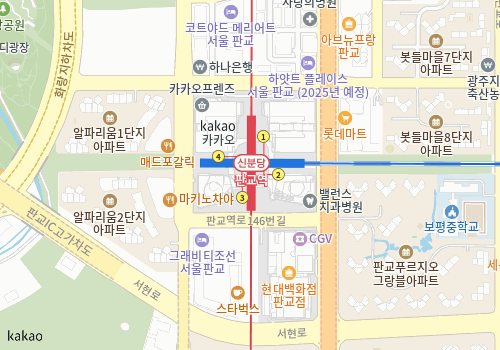
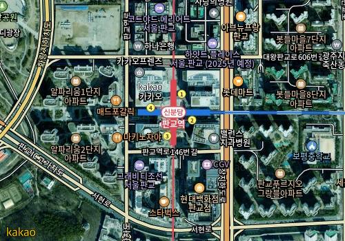

# 지도 그리기

## 1. 지도 위젯 그리기

[KakaoMap](https://pub.dev/documentation/kakao_map_sdk/latest/kakao_map_sdk/KakaoMap-class.html) 위젯 함수를 호출하여 지도를 애플리케이션에 그릴 수 있습니다.

```dart
Widget mapWidget(BuildContext context) => KakaoMap(
  onMapReady: (KakaoMapController controller) {
    print("카카오맵이 불러와졌습니다.")
  },
  option: const KakaoMapOption(position: LatLng(37.394776, 127.11116)),
);
```

위 소스 코드와 같이 `KakaoMap` 객체를 호출하면 [StatefulWidget](https://api.flutter.dev/flutter/widgets/StatefulWidget-class.html)이 반환됩니다. \
`KakaoMap` 객체를 호출하기 위해서는 두 인수가 필요하며 인수의 용도는 다음과 같습니다.

* onMapReady: 지도를 불러오는데 성공하면 호출되는 함수이며, 지도를 조작할 수 있는 [KakaoMapController](https://pub.dev/documentation/kakao_map_sdk/latest/kakao_map_sdk/KakaoMapController-class.html) 객체와 함께 호출됩니다.
* option: [KakaoMapOption](https://pub.dev/documentation/kakao_map_sdk/latest/kakao_map_sdk/KakaoMapOption-class.html) 객체가 입력되며, 지도의 기본 정보를 정의할 수 있습니다.

## 2. 지도 기본 정보 설정하기

사용자에게 노출되는 첫 지도 화면은 [KakaoMapOption](https://pub.dev/documentation/kakao_map_sdk/latest/kakao_map_sdk/KakaoMapOption-class.html) 객체를 `option` 인수에 전달하여 설정할 수 있습니다.\
[KakaoMapOption](https://pub.dev/documentation/kakao_map_sdk/latest/kakao_map_sdk/KakaoMapOption-class.html) 객체로 지도를 사용자에게 제공하는 카메라의 위치, 지도 유형 등을 설정할 수 있습니다.

### 2-1. 카메라의 위치 설정

사용자에게 처음 보여주는 지도의 카메라 위치는 [KakaoMapOption](https://pub.dev/documentation/kakao_map_sdk/latest/kakao_map_sdk/KakaoMapOption-class.html) 객체를 통해 설정하실 수 있습니다. 아래의 항목에 있는 두 인수를 객체에 제공하여 카메라의 위치를 설정할 수 있습니다.

* position: WGS84(위도/경도)로 구성된 [LatLng](https://pub.dev/documentation/kakao_map_sdk/latest/kakao_map_sdk/LatLng-class.html) 객체가 입력되며 카메라의 위치를 설정합니다.
* zoomLevel: 6단계부터 21단계까지 정수로 구성되며 값에 따라 카메라의 확대, 축소 비율을 조정합니다. 값이 작을 수록 더 넓은 지역을 카메라에 담을 수 있으며, 반대로 값이 클수록 더 상세한 화면을 확인할 수 있습니다.

```dart
final option = const KakaoMapOption(
  position: LatLng(37.394776, 127.11116),
  zoomLevel: 16
);
```

### 2-2. 지도 유형 설정

지도의 유형은 [MapType](https://pub.dev/documentation/kakao_map_sdk/latest/kakao_map_sdk/MapType.html) 객체를 통해 설정할 수 있으며, [KakaoMapOption](https://pub.dev/documentation/kakao_map_sdk/latest/kakao_map_sdk/KakaoMapOption-class.html) 객체에 `mapType` 인수를 제공하거나,   [KakaoMapController.changeMapType()](https://pub.dev/documentation/kakao_map_sdk/latest/kakao_map_sdk/KakaoMapController/changeMapType.html) 함수로 설정할 수 있습니다.

| 일반 지도 (Normal)                                                                                              | 위성 지도 (Skyview)                                                                                                    |
| ----------------------------------------------------------------------------------------------------------- | ------------------------------------------------------------------------------------------------------------------ |
| <div><figure><figcaption></figcaption></figure></div> | <div><figure><figcaption></figcaption></figure></div> |

```dart
Future<void> changeMapType(KakaoMapController controller) async {
  // 지도 유형을 일반 지도로 전환합니다.
  await controller.changeMapType(MapType.normal);
}
```

## 3. 지도 오버레이 그리기

지도 위에 교통정보, 자전거도로 등 추가적인 정보를 덧씌워 표시할 수 있습니다.\
[MapOverlay](https://pub.dev/documentation/kakao_map_sdk/latest/kakao_map_sdk/MapOverlay.html) 열거형으로 오버레이 종류를 지정하며, [KakaoMapController](https://pub.dev/documentation/kakao_map_sdk/latest/kakao_map_sdk/KakaoMapController-class.html)의 `showOverlay()` / `hideOverlay()` 함수로 표시 여부를 제어합니다.

### 3-1. 오버레이 종류

지도에 표시할 수 있는 오버레이의 종류는 다음과 같습니다.

| 오버레이               | 열거형 값                      | 설명                          |
| ------------------ | -------------------------- | --------------------------- |
| 자전거도로              | `MapOverlay.bicycleRoad`   | 자전거 도로를 지도 위에 표시합니다.        |
| 로드뷰 라인             | `MapOverlay.roadviewLine`  | 로드뷰 촬영 경로를 지도 위에 표시합니다.     |
| 힐쉐이딩               | `MapOverlay.hillshading`   | 지형 음영을 지도 위에 표시합니다.         |
| 하이브리드 (스카이뷰 레이블)   | `MapOverlay.hybrid`        | 스카이뷰 위에 도로명·지명 레이블을 표시합니다.  |

> 교통정보(traffic\_info) 오버레이는 별도 협의가 필요하며 기본 제공되지 않습니다.

### 3-2. 오버레이 표시/숨기기

`showOverlay()` 함수에 [MapOverlay](https://pub.dev/documentation/kakao_map_sdk/latest/kakao_map_sdk/MapOverlay.html) 값을 전달하면 해당 오버레이가 지도에 표시되고, `hideOverlay()` 함수를 호출하면 숨길 수 있습니다.

```dart
Future<void> toggleOverlay(KakaoMapController controller) async {
  // 자전거도로 오버레이를 표시합니다.
  await controller.showOverlay(MapOverlay.bicycleRoad);

  // 자전거도로 오버레이를 숨깁니다.
  await controller.hideOverlay(MapOverlay.bicycleRoad);
}
```

