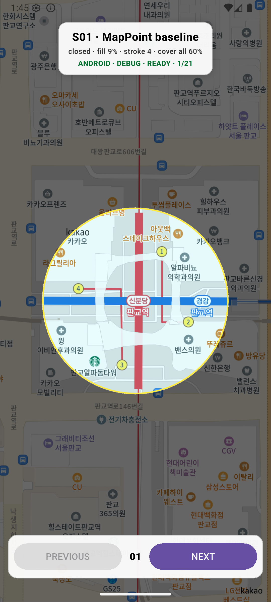
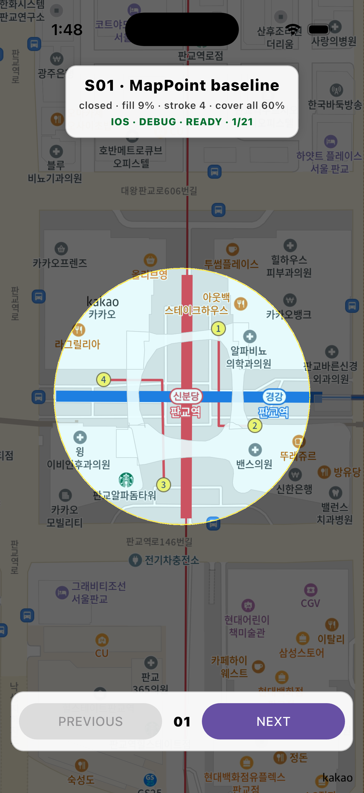
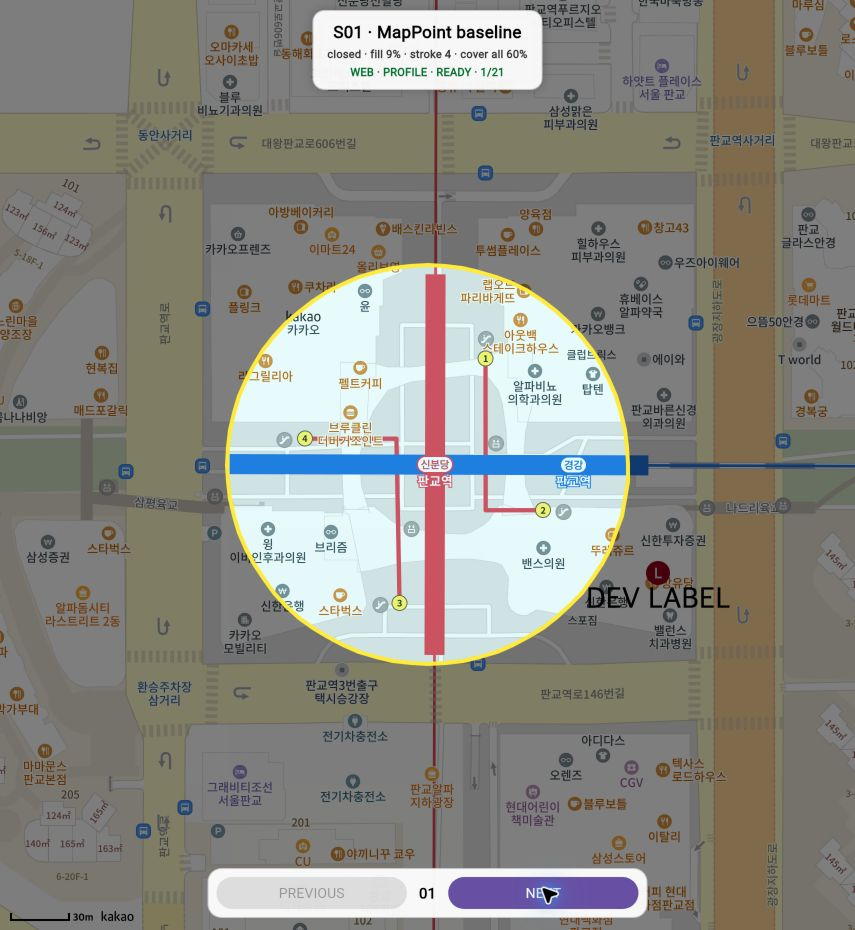
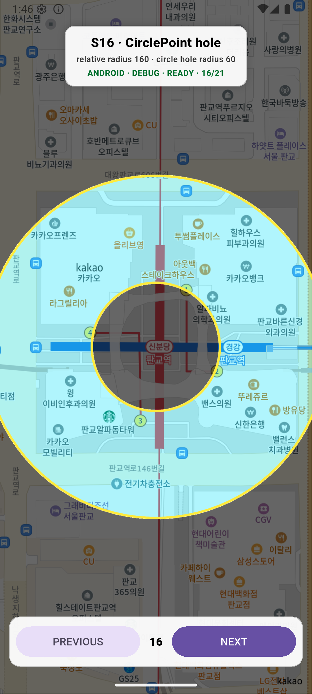
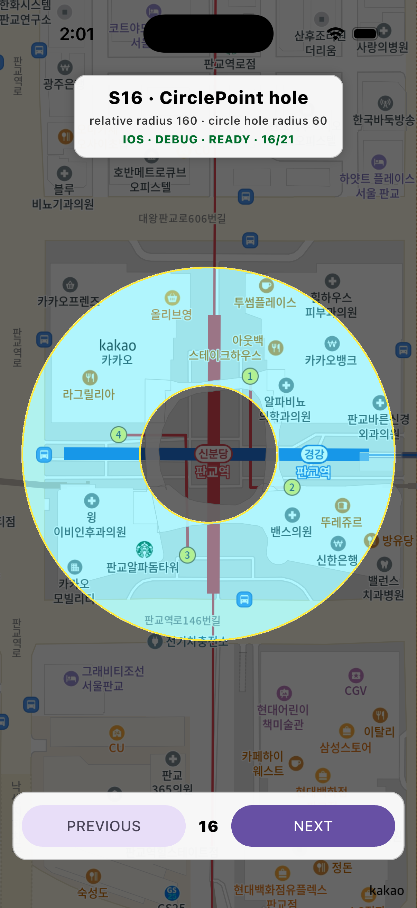
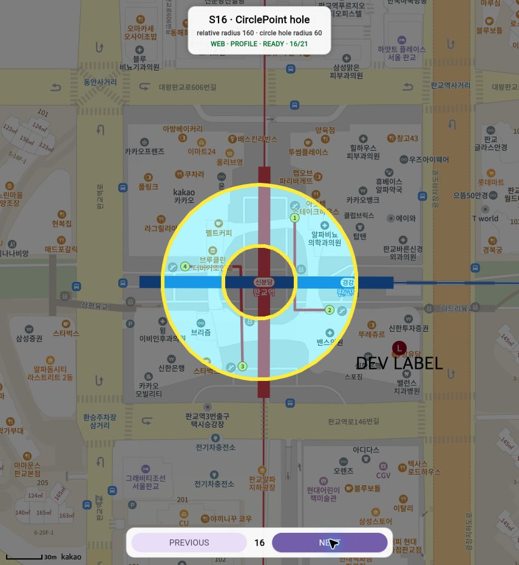

# 지도 덮어씌우기 (DimScreen)

DimScreen은 지도 위에 반투명 색상을 덮고 Polygon 영역을 highlight로 남깁니다. 특정 지역 안내, 선택 영역 강조, 단계별 온보딩에 사용할 수 있습니다.

`KakaoMapController.dimScreen`은 지도마다 하나만 제공되며 직접 생성하거나 삭제하지 않습니다.

## 1. 플랫폼 결과

아래는 닫힌 MapPoint, 반투명 cover, fill과 stroke를 같은 조건으로 적용한 테스트 결과입니다. Web 이미지는 `127.0.0.1:8080` Profile 모드의 최종 통과 artifact입니다.

<table>
  <thead>
    <tr><th>Android</th><th>iOS</th><th>Web · Profile · 8080</th></tr>
  </thead>
  <tbody>
    <tr>
      <td></td>
      <td></td>
      <td></td>
    </tr>
  </tbody>
</table>

> 상단 시나리오 카드와 하단 이동 버튼은 21개 계약 시나리오를 비교한 테스트 harness입니다. 실제 앱에는 나타나지 않습니다.

## 2. 색상과 표시 상태

DimScreen의 기본 색상은 alpha 128의 검정이며 초기 상태는 숨김입니다.

```dart
await controller.dimScreen.setColor(
  Colors.black.withAlpha(153), // 60% 불투명도
);
await controller.dimScreen.setVisible(true);

// 다시 숨기기
await controller.dimScreen.setVisible(false);
```

현재 값은 `controller.dimScreen.color`, `visible`, `cover`로 읽을 수 있습니다.

## 3. 덮을 범위

```dart
await controller.dimScreen.setCover(DimScreenCover.all);
```

| 값 | 범위 |
| --- | --- |
| `DimScreenCover.all` | 지도 위 전체 대상 |
| `DimScreenCover.map` | 지도 배경만 dim. Label은 원래 색상 유지 |
| `DimScreenCover.mapAndLabel` | 지도 배경과 Poi·custom label·PolylineText를 함께 dim |

Web은 `mapAndLabel`에서 CustomOverlay label의 색상을 cover alpha와 합성하여 native 동작에 맞춥니다.

## 4. MapPoint highlight

PolygonStyle의 fill은 highlight 안쪽에 보이는 색, stroke는 경계선입니다. fill을 완전히 투명하게 만들면 내부 지도만 선명하게 보입니다.

```dart
final style = PolygonStyle(
  Colors.lightBlueAccent.withAlpha(64), // 약 25% 불투명도
  strokeColor: Colors.yellowAccent,
  strokeWidth: 6,
);

final highlight = await controller.dimScreen.addPolygonShape(
  MapPoint([
    const LatLng(37.393, 127.109),
    const LatLng(37.393, 127.113),
    const LatLng(37.397, 127.113),
    const LatLng(37.397, 127.109),
    const LatLng(37.393, 127.109),
  ]),
  style,
  id: 'pangyo-highlight',
);
```

스타일을 별도로 등록하지 않아도 `addPolygonShape()`가 자동 등록합니다.

> MapPoint의 첫 좌표와 마지막 좌표가 다르면 stroke는 열린 경로를 유지합니다. 닫힌 테두리가 필요하면 마지막 좌표를 첫 좌표와 같게 입력하세요.

## 5. CirclePoint·RectanglePoint

기준 좌표를 중심으로 화면 상대 크기의 원이나 사각형 highlight를 만들 수 있습니다.

```dart
final circle = await controller.dimScreen.addPolygonShape(
  CirclePoint(
    150,
    const LatLng(37.394776, 127.11116),
  ),
  PolygonStyle(Colors.transparent),
  id: 'circle-highlight',
);

final rectangle = await controller.dimScreen.addPolygonShape(
  RectanglePoint(
    300,
    160,
    const LatLng(37.394776, 127.11116),
  ),
  PolygonStyle(Colors.transparent),
  id: 'rectangle-highlight',
);
```

상대 도형은 확대·축소 후에도 의도한 화면상 크기를 유지하도록 다시 투영됩니다.

## 6. Hole

highlight Polygon 내부에 다시 dim 처리할 hole을 추가할 수 있습니다.

```dart
final position = CirclePoint(
  160,
  const LatLng(37.394776, 127.11116),
);
position.addCircleHole(60);

final highlightWithHole =
    await controller.dimScreen.addPolygonShape(
  position,
  PolygonStyle(
    Colors.lightBlueAccent.withAlpha(64),
    strokeColor: Colors.yellowAccent,
    strokeWidth: 4,
  ),
);
```

<table>
  <thead>
    <tr><th>Android</th><th>iOS</th><th>Web · Profile · 8080</th></tr>
  </thead>
  <tbody>
    <tr>
      <td></td>
      <td></td>
      <td></td>
    </tr>
  </tbody>
</table>

`MapPoint.addHole()`, `CirclePoint.addCircleHole()`, `RectanglePoint.addRetangleHole()`을 사용할 수 있습니다.

## 7. 변경·조회·삭제

DimScreen highlight는 `Polygon`이므로 Shape Polygon과 같은 변경 API를 사용합니다.

```dart
await highlight.changeStyle(
  PolygonStyle(
    Colors.transparent,
    strokeColor: Colors.orange,
    strokeWidth: 8,
  ),
);

await highlight.changePosition(newPosition);
await highlight.hide();
await highlight.show();

final same = controller.dimScreen.getPolygonShape('pangyo-highlight');

await controller.dimScreen.removePolygonShape(highlight);
// 또는
await highlight.remove();
```

여러 highlight가 겹치면 `addPolygonShape(zOrder:)`의 값이 큰 Polygon이 위에 표시됩니다.

## 8. 전체 구성 순서

```dart
Future<void> configureDimScreen(KakaoMapController controller) async {
  await controller.dimScreen.setVisible(false);
  await controller.dimScreen.setCover(DimScreenCover.mapAndLabel);
  await controller.dimScreen.setColor(
    Colors.black.withAlpha(153),
  );

  await controller.dimScreen.addPolygonShape(
    CirclePoint(150, const LatLng(37.394776, 127.11116)),
    PolygonStyle(
      Colors.transparent,
      strokeColor: Colors.yellow,
      strokeWidth: 4,
    ),
    id: 'focus',
  );

  await controller.dimScreen.setVisible(true);
}
```

구성 중간의 깜빡임을 줄이려면 숨긴 상태에서 색상·범위·highlight를 준비한 뒤 마지막에 표시하세요.
