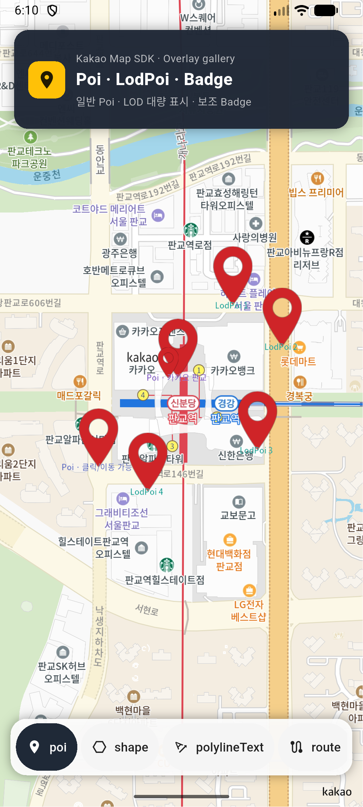
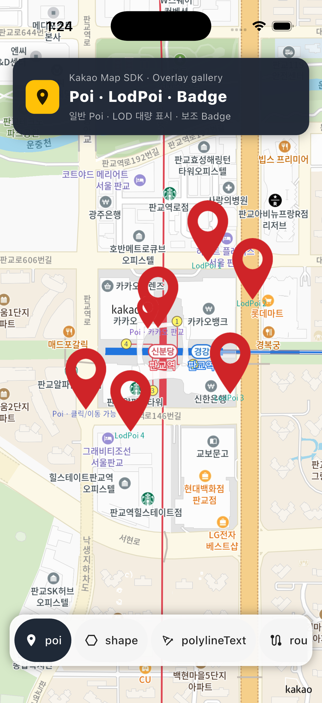
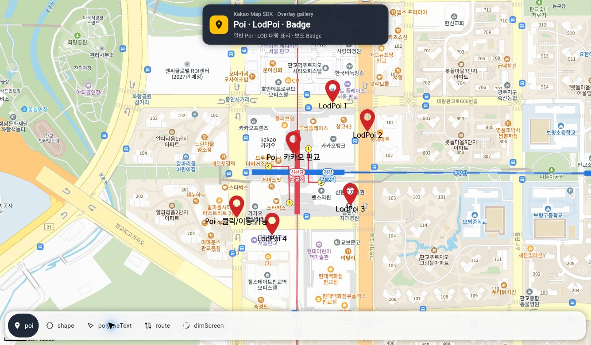

# 특정 요소 (Poi, LodPoi)

Poi(Point of Interest)는 지도 좌표에 아이콘과 텍스트를 표시합니다. `LabelController`는 일반 Poi를, `LodLabelController`는 대량 표시를 위한 LodPoi를 관리합니다.

아래 화면은 일반 Poi의 아이콘·텍스트·Badge와 여러 LodPoi를 같은 Pangyo 좌표 영역에 표시한 실제 실행 결과입니다. Web은 `127.0.0.1:8080` Profile 모드로 촬영했습니다.

<table>
  <thead>
    <tr><th>Android</th><th>iOS</th><th>Web · Profile · 8080</th></tr>
  </thead>
  <tbody>
    <tr>
      <td></td>
      <td></td>
      <td></td>
    </tr>
  </tbody>
</table>

## 1. PoiStyle 만들기

```dart
final style = PoiStyle(
  id: 'place-marker',
  icon: KImage.fromAsset('assets/marker.png', 40, 60),
  anchor: const KPoint(0.5, 1.0),
  textGravity: const MapGravity(
    HorizontalAlign.center,
    VerticalAlign.bottom,
  ),
  textStyle: const [
    PoiTextStyle(
      size: 20,
      color: Colors.black,
      stroke: 2,
      strokeColor: Colors.white,
    ),
  ],
  iconTransition: const PoiTransition(
    entrance: Transition.scale,
    exit: Transition.alpha,
  ),
);
```

| Property | 설명 |
| --- | --- |
| `icon` | Asset, byte data, file 또는 Widget으로 만든 `KImage` |
| `anchor` | 지도 좌표에 맞출 아이콘 기준점 |
| `padding` | 아이콘 여백 |
| `textGravity` | 아이콘 기준 텍스트 배치 |
| `textStyle` | 줄별 `PoiTextStyle` 목록 |
| `iconTransition` / `textTransition` | 등장·퇴장 alpha 또는 scale 효과 |
| `zoomLevel` | 스타일 적용을 시작할 줌 레벨 |
| `applyDpScale` | Android 픽셀 밀도 반영 여부 |

스타일은 오버레이를 추가할 때 자동 등록됩니다. 여러 Poi에 같은 스타일을 사용하거나 등록 오류를 먼저 처리하려면 직접 등록합니다.

```dart
await controller.addPoiStyle(style);
```

### 1-1. 줌 레벨별 스타일

```dart
final adaptiveStyle = PoiStyle(
  icon: KImage.fromAsset('assets/marker-small.png', 20, 30),
  zoomLevel: 0,
);

adaptiveStyle.addStyle(
  zoomLevel: 14,
  icon: KImage.fromAsset('assets/marker-large.png', 40, 60),
);
```

추가한 스타일은 `getStyle(14)`, `removeStyle(14)`, `otherStyles`로 관리할 수 있습니다.

## 2. Poi 추가

```dart
final poi = await controller.labelLayer.addPoi(
  const LatLng(37.394776, 127.11116),
  id: 'kakao-pangyo',
  style: style,
  text: '카카오 판교캠퍼스',
  rank: 0,
  visible: true,
  onClick: () {
    debugPrint('개별 Poi 클릭');
  },
);
```

| Parameter | 설명 |
| --- | --- |
| `position` | Poi를 표시할 위·경도 |
| `style` | `PoiStyle` |
| `id` | 선택적 고유 ID |
| `text` | 표시할 텍스트 |
| `transform` | 지도 회전·기울기에 대한 자세 |
| `rank` | 같은 레이어에서 경쟁할 때 우선순위 |
| `onClick` | 이 Poi의 클릭 콜백 |
| `visible` | 초기 표시 여부 |

## 3. TransformMethod

| 값 | 동작 |
| --- | --- |
| `following` | 화면 위쪽을 유지하는 기본 자세 |
| `absoluteRoatation` | 고유 회전 방향 유지. API 이름의 철자에 주의 |
| `absoluteRotationKeepUpright` | 아이콘 회전은 유지하고 텍스트는 위쪽 유지 |
| `absoluteRotationDecal` | 회전과 지도 기울기를 함께 반영 |
| `decal` | 지도 기울기를 따라감 |
| `one` | 플랫폼 raw value `-1`을 전달하는 호환 값 |

Web은 카메라 회전·기울기를 지원하지 않으므로 관련 transform의 시각 결과가 네이티브와 다를 수 있습니다.

## 4. 클릭 이벤트

`addPoi(onClick:)`은 개별 요소 로직에, `KakaoMap.onPoiClick`은 화면 전체의 공통 로직에 적합합니다.

```dart
KakaoMap(
  onMapReady: (controller) {},
  onPoiClick: (layer, poi) {
    debugPrint('클릭: ${layer.id} / ${poi.id}');
  },
);
```

레이어 클릭을 일괄 비활성화할 수도 있습니다.

```dart
await controller.labelLayer.setClickable(false);
```

## 5. Poi 변경

```dart
await poi.move(const LatLng(37.402005, 127.108621));
await poi.move(const LatLng(37.402005, 127.108621), 1000);

await poi.rotate(45);
await poi.scale(1.5, 1.5);
await poi.changeRank(10);

final selectedStyle = style.copyWith(
  icon: KImage.fromAsset('assets/marker-selected.png', 48, 72),
);
await controller.addPoiStyle(selectedStyle);
await poi.changeStyles(selectedStyle, true);

await poi.changeText('선택됨', true);
```

경로 이동은 전체 시간과 곡선·점프 조건을 함께 설정할 수 있습니다.

```dart
await poi.movePath(
  const [
    LatLng(37.394776, 127.111160),
    LatLng(37.397000, 127.112000),
    LatLng(37.402005, 127.108621),
  ],
  5000,
  cornerRadius: 40,
  jumpThreshold: 200,
);
```

표시와 삭제:

```dart
await poi.hide();
await poi.show();
await poi.remove();

await controller.labelLayer.hideAllPoi();
await controller.labelLayer.showAllPoi();
```

## 6. Badge

Poi와 LodPoi에는 보조 이미지를 Badge로 추가할 수 있습니다. x·y 값은 Poi 이미지 중앙을 기준으로 한 offset입니다.

```dart
final badge = await poi.addBadge(
  KImage.fromAsset('assets/badge.png', 24, 24),
  0.15,
  0.7,
  badgeId: 'sale',
  zOrder: 1,
);

await badge.hide();
await badge.show();
await badge.remove();
```

`removeAllBadge()`로 한 Poi의 Badge를 일괄 삭제할 수 있습니다.

## 7. 위치·transform 공유

```dart
await poi.addSharePosition(otherPoi);
await poi.addShareTransformPoi(directionPoi);
await poi.addShareTransformShape(shape);

await poi.removeSharePosition(otherPoi);
await poi.removeShareTransformPoi(directionPoi);
await poi.removeShareTransformShape(shape);
```

Web에서는 Poi와 Shape 사이의 transform 공유가 지원되지 않습니다.

## 8. LodPoi

LodPoi는 네이티브에서 줌과 밀집도에 따라 표시할 요소를 최적화합니다. 이동과 회전은 지원하지 않으며 스타일·텍스트·순위·표시 상태와 Badge를 변경할 수 있습니다.

```dart
final lodStyle = PoiStyle(
  icon: KImage.fromAsset('assets/store.png', 30, 30),
);

for (final location in locations) {
  await controller.lodLabelLayer.addLodPoi(
    location,
    style: lodStyle,
    text: '가게',
  );
}
```

커스텀 LodLabelLayer의 `radius`로 경쟁 반경을 설정합니다.

```dart
final lodLayer = await controller.addLodLabelLayer(
  'store-lod-layer',
  radius: 50,
  zOrder: 10005,
);
```

Web에서는 LodPoi가 LOD 최적화 없이 일반 Poi와 유사하게 동작합니다.

## 9. 커스텀 LabelLayer

```dart
final layer = await controller.addLabelLayer(
  'search-results',
  zOrder: 10010,
  competitionType: CompetitionType.none,
);

await layer.addPoi(
  const LatLng(37.394776, 127.11116),
  style: style.copyWith(),
);

final sameLayer = controller.getLabelLayer('search-results');
await controller.removeLabelLayer(layer);
```

카메라가 Poi를 따라가게 하려면 [Poi 추적하기](tracking.md)를 참고하세요.
