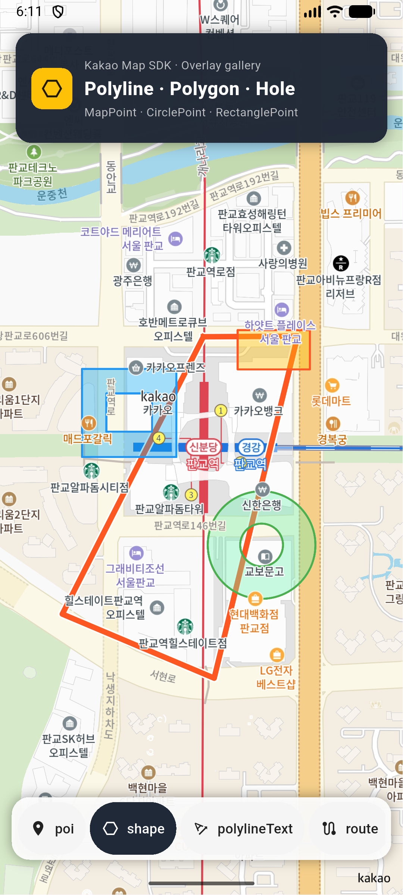
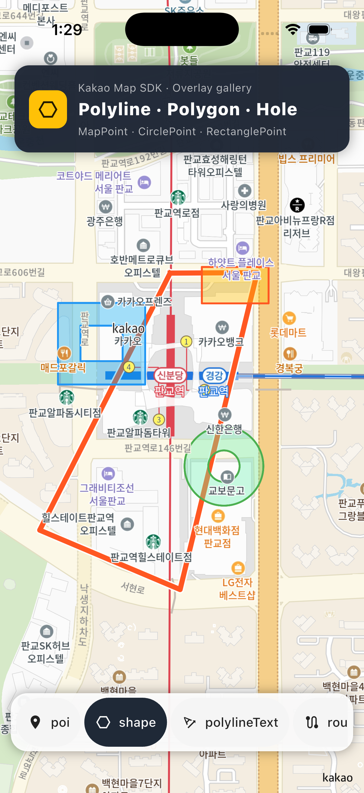
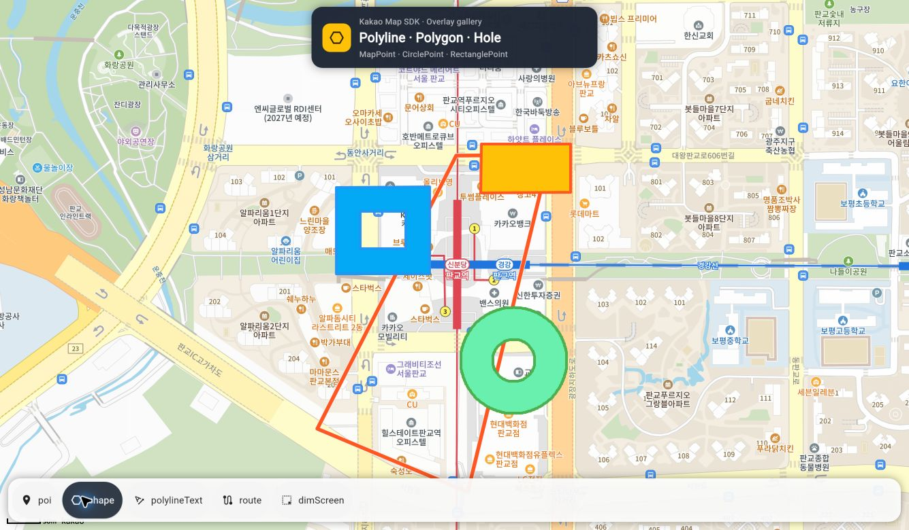

# 도형 (Polyline, Polygon)

Polyline과 Polygon은 지도 위에 선과 면을 그릴 수 있는 도형 요소입니다.\
[ShapeController](https://pub.dev/documentation/kakao_map_sdk/latest/kakao_map_sdk/ShapeController-class.html)를 통해 도형을 생성하고 관리할 수 있습니다.

아래 화면은 닫힌 MapPoint Polyline, MapPoint Polygon hole, CirclePoint hole, RectanglePoint를 함께 표시한 실제 실행 결과입니다. Web은 `127.0.0.1:8080` Profile 모드로 촬영했습니다.

<table>
  <thead>
    <tr><th>Android</th><th>iOS</th><th>Web · Profile · 8080</th></tr>
  </thead>
  <tbody>
    <tr>
      <td></td>
      <td></td>
      <td></td>
    </tr>
  </tbody>
</table>

## 1. 도형 스타일 등록하기

도형을 추가할 때 등록되지 않은 스타일은 자동으로 등록됩니다. 여러 도형에 같은 스타일을 공유하거나 등록 오류를 먼저 처리하려면 명시적으로 등록할 수 있습니다.

### 1-1. Polyline 스타일

[PolylineStyle](https://pub.dev/documentation/kakao_map_sdk/latest/kakao_map_sdk/PolylineStyle-class.html) 객체를 생성하고 [KakaoMapController.addPolylineShapeStyle()](https://pub.dev/documentation/kakao_map_sdk/latest/kakao_map_sdk/KakaoMapController/addPolylineShapeStyle.html) 함수로 등록합니다.

```dart
Future<void> addPolylineStyleExample(KakaoMapController controller) async {
  final style = PolylineStyle(
    Colors.blue,  // 선 색상
    10.0,         // 선 두께 (픽셀)
    strokeWidth: 2.0,
    strokeColor: Colors.white,
  );
  await controller.addPolylineShapeStyle(style, PolylineCap.round);
}
```

<table><thead><tr><th width="150">Property</th><th>Description</th></tr></thead><tbody><tr><td>color</td><td>Polyline의 색상입니다.</td></tr><tr><td>lineWidth</td><td>Polyline의 두께입니다. 픽셀 단위로 입력합니다.</td></tr><tr><td>strokeWidth</td><td>Polyline 외곽선의 두께입니다.</td></tr><tr><td>strokeColor</td><td>Polyline 외곽선의 색상입니다.</td></tr><tr><td>zoomLevel</td><td>이 스타일이 적용되기 시작하는 최소 줌 레벨입니다.</td></tr></tbody></table>

[PolylineCap](https://pub.dev/documentation/kakao_map_sdk/latest/kakao_map_sdk/PolylineCap.html)은 Polyline 꼭지점의 모양을 결정합니다.

<table><thead><tr><th width="150">Value</th><th>Description</th></tr></thead><tbody><tr><td>round</td><td>꼭지점이 둥글게 처리됩니다.</td></tr><tr><td>butt</td><td>꼭지점이 선의 끝에서 수직으로 절단됩니다.</td></tr><tr><td>square</td><td>꼭지점이 정사각형 모양으로 처리됩니다.</td></tr></tbody></table>

### 1-2. Polygon 스타일

[PolygonStyle](https://pub.dev/documentation/kakao_map_sdk/latest/kakao_map_sdk/PolygonStyle-class.html) 객체를 생성하고 [KakaoMapController.addPolygonShapeStyle()](https://pub.dev/documentation/kakao_map_sdk/latest/kakao_map_sdk/KakaoMapController/addPolygonShapeStyle.html) 함수로 등록합니다.

```dart
Future<void> addPolygonStyleExample(KakaoMapController controller) async {
  final style = PolygonStyle(
    Colors.blue.withAlpha(77), // 약 30% 불투명도
    strokeWidth: 2.0,
    strokeColor: Colors.blue,
  );
  await controller.addPolygonShapeStyle(style);
}
```

<table><thead><tr><th width="150">Property</th><th>Description</th></tr></thead><tbody><tr><td>color</td><td>Polygon 내부의 채우기 색상입니다.</td></tr><tr><td>strokeWidth</td><td>Polygon 외곽선의 두께입니다.</td></tr><tr><td>strokeColor</td><td>Polygon 외곽선의 색상입니다.</td></tr><tr><td>zoomLevel</td><td>이 스타일이 적용되기 시작하는 최소 줌 레벨입니다.</td></tr></tbody></table>

### 1-3. 줌 레벨별 스타일 설정

도형 스타일도 줌 레벨에 따라 다르게 적용할 수 있습니다.\
[PolylineStyle.addStyle()](https://pub.dev/documentation/kakao_map_sdk/latest/kakao_map_sdk/PolylineStyle/addStyle.html) 또는 [PolygonStyle.addStyle()](https://pub.dev/documentation/kakao_map_sdk/latest/kakao_map_sdk/PolygonStyle/addStyle.html) 함수를 사용합니다.

```dart
final style = PolylineStyle(Colors.grey, 4.0, zoomLevel: 0);
style.addStyle(14, color: Colors.blue, lineWidth: 8.0);  // 줌 레벨 14 이상에서 적용
style.addStyle(17, color: Colors.blue, lineWidth: 12.0); // 줌 레벨 17 이상에서 적용
await controller.addPolylineShapeStyle(style, PolylineCap.round);
```

> 줌 레벨 값은 낮은 값부터 순서대로 입력해야 정상적으로 동작합니다.

## 2. 위치 유형 (BasePoint)

도형의 위치를 지정하는 방법은 두 가지가 있습니다.

### 2-1. MapPoint (절대 위치)

실제 위경도 좌표 목록을 꼭지점으로 지정합니다. 행정 경계, 실제 도로 경로 등 지리적으로 정확한 도형이 필요할 때 사용합니다.

```dart
final position = MapPoint([
  const LatLng(37.394, 127.111),
  const LatLng(37.395, 127.112),
  const LatLng(37.396, 127.111),
  const LatLng(37.394, 127.111), // 시작점과 동일하게 설정하면 닫힌 도형이 됩니다.
]);
```

Polygon에서 내부 구멍(hole)을 추가하면 도넛 형태의 도형을 그릴 수 있습니다.

```dart
position.addHole([
  const LatLng(37.3945, 127.1113),
  const LatLng(37.3948, 127.1118),
  const LatLng(37.3950, 127.1113),
]);
```

### 2-2. CirclePoint (원형 상대 위치)

특정 기준 좌표를 중심으로 반경(픽셀)을 지정하여 원 형태의 도형을 그립니다.

```dart
final position = CirclePoint(
  100.0,                              // 반경 (픽셀)
  const LatLng(37.394776, 127.11116), // 중심 좌표
  clockwise: true,
);
```

원형 내부에 구멍을 추가할 수도 있습니다.

```dart
position.addCircleHole(40.0); // 반경 40픽셀의 원형 구멍
```

### 2-3. RectanglePoint (사각형 상대 위치)

특정 기준 좌표를 중심으로 너비와 높이(픽셀)를 지정하여 사각형 도형을 그립니다.

```dart
final position = RectanglePoint(
  200.0,                              // 너비 (픽셀)
  100.0,                              // 높이 (픽셀)
  const LatLng(37.394776, 127.11116), // 기준 좌표 (중심)
);
```

사각형 내부에 구멍을 추가할 수도 있습니다.

```dart
position.addRetangleHole(80.0, 40.0); // 80x40픽셀의 사각형 구멍
```

## 3. Polyline 추가하기

[ShapeController.addPolylineShape()](https://pub.dev/documentation/kakao_map_sdk/latest/kakao_map_sdk/ShapeController/addPolylineShape.html) 함수를 이용하여 지도에 선을 추가할 수 있습니다.\
[KakaoMapController.shapeLayer](https://pub.dev/documentation/kakao_map_sdk/latest/kakao_map_sdk/KakaoMapController/shapeLayer.html)를 통해 기본 ShapeLayer에 접근합니다.

```dart
Future<void> addPolylineExample(KakaoMapController controller) async {
  final style = PolylineStyle(Colors.deepOrange, 12.0);
  await controller.addPolylineShapeStyle(style, PolylineCap.round);

  final polyline = await controller.shapeLayer.addPolylineShape(
    MapPoint([
      const LatLng(37.394776, 127.11116),
      const LatLng(37.450, 127.050),
      const LatLng(37.56664, 126.97822),
    ]),
    style,
    PolylineCap.round,
  );
}
```

### 3-1. Polyline 조작

```dart
// 스타일 변경
final newStyle = PolylineStyle(Colors.red, 8.0);
await controller.addPolylineShapeStyle(newStyle, PolylineCap.butt);
await polyline.changeStyle(newStyle, PolylineCap.butt);

// 위치 변경
await polyline.changePosition(MapPoint([/* 새로운 좌표 목록 */]));

// 표시/숨기기 및 삭제
await polyline.show();
await polyline.hide();
await polyline.remove();

// 레이어 내 모든 Polyline 일괄 제어
await controller.shapeLayer.showAllPolyline();
await controller.shapeLayer.hideAllPolyline();
```

## 4. Polygon 추가하기

[ShapeController.addPolygonShape()](https://pub.dev/documentation/kakao_map_sdk/latest/kakao_map_sdk/ShapeController/addPolygonShape.html) 함수를 이용하여 지도에 면을 추가할 수 있습니다.

```dart
Future<void> addPolygonExample(KakaoMapController controller) async {
  final style = PolygonStyle(
    Colors.blue.withAlpha(77),
    strokeWidth: 2.0,
    strokeColor: Colors.blue,
  );
  await controller.addPolygonShapeStyle(style);

  final polygon = await controller.shapeLayer.addPolygonShape(
    MapPoint([
      const LatLng(37.394, 127.111),
      const LatLng(37.397, 127.114),
      const LatLng(37.397, 127.108),
      const LatLng(37.394, 127.111),
    ]),
    style,
  );
}
```

### 4-1. 원형/사각형 Polygon

```dart
// 원형 Polygon
final circlePolygon = await controller.shapeLayer.addPolygonShape(
  CirclePoint(
    150.0,
    const LatLng(37.394776, 127.11116),
  ),
  style,
);

// 사각형 Polygon
final rectPolygon = await controller.shapeLayer.addPolygonShape(
  RectanglePoint(
    300.0,
    150.0,
    const LatLng(37.394776, 127.11116),
  ),
  style,
);
```

### 4-2. 구멍이 있는 Polygon

내부에 구멍(Hole)을 추가하면 도넛 형태의 Polygon을 그릴 수 있습니다.

```dart
final position = MapPoint([
  const LatLng(37.393, 127.109),
  const LatLng(37.393, 127.113),
  const LatLng(37.397, 127.113),
  const LatLng(37.397, 127.109),
]);

// 내부에 사각형 구멍 추가
position.addHole([
  const LatLng(37.394, 127.110),
  const LatLng(37.394, 127.112),
  const LatLng(37.396, 127.112),
  const LatLng(37.396, 127.110),
]);

final polygon = await controller.shapeLayer.addPolygonShape(position, style);
```

> `MapPoint` 경로를 닫으려면 마지막 좌표를 첫 좌표와 같게 입력합니다. 열린 MapPoint의 fill은 면으로 보일 수 있지만 stroke 경로는 호출자가 전달한 열린 상태를 유지합니다.

### 4-3. Polygon 조작

```dart
// 스타일 변경
final newStyle = PolygonStyle(Colors.red.withAlpha(77));
await controller.addPolygonShapeStyle(newStyle);
await polygon.changeStyle(newStyle);

// 위치 변경
await polygon.changePosition(MapPoint([/* 새로운 좌표 목록 */]));

// 표시/숨기기 및 삭제
await polygon.show();
await polygon.hide();
await polygon.remove();

// 레이어 내 모든 Polygon 일괄 제어
await controller.shapeLayer.showAllPolygon();
await controller.shapeLayer.hideAllPolygon();
```

## 5. 커스텀 ShapeLayer 생성하기

기본 레이어 외에 커스텀 ShapeLayer를 생성하여 도형을 독립적으로 관리할 수 있습니다.

```dart
Future<void> customShapeLayerExample(KakaoMapController controller) async {
  final myLayer = await controller.addShapeLayer(
    'my_shape_layer',
    zOrder: 10002,
  );

  await myLayer.addPolylineShape(
    MapPoint([/* 좌표 목록 */]),
    style,
    PolylineCap.round,
  );

  // ID로 레이어 가져오기
  final sameLayer = controller.getShapeLayer('my_shape_layer');

  // 레이어 삭제
await controller.removeShapeLayer(myLayer);
}
```

## 6. 플랫폼별 주의사항

* `MapPoint`는 실제 위·경도 경계를 표현할 때 사용합니다.
* `CirclePoint`와 `RectanglePoint`는 기준 좌표에 대한 화면 상대 크기로 렌더링되어 줌을 바꿔도 시각 크기를 유지하는 용도에 적합합니다.
* `CirclePoint.vertexCount`에 따른 세부 tessellation은 네이티브 SDK와 Web 구현에서 차이가 날 수 있으므로 플랫폼 간 픽셀 단위 동일성을 전제로 하지 마세요.
* 겹친 도형의 순서는 레이어 `zOrder`와 개별 도형의 `zOrder`를 함께 확인하세요.
