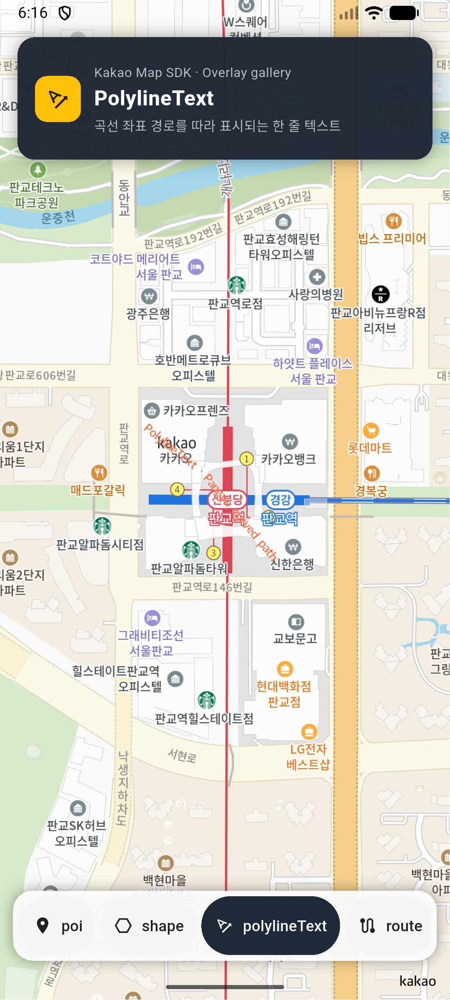
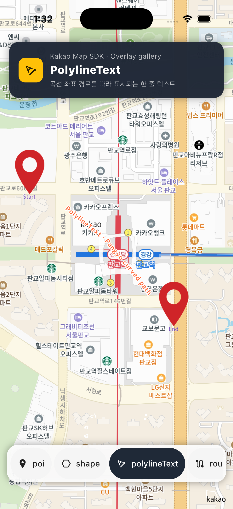
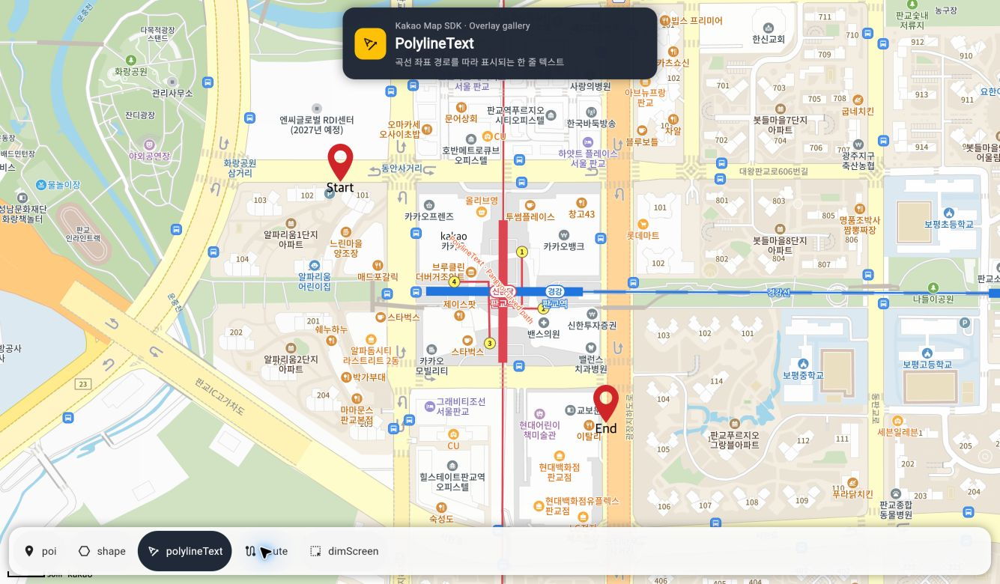

# 휘어지는 글씨 (PolylineText)

PolylineText는 여러 `LatLng`으로 만든 경로를 따라 한 줄 텍스트를 표시합니다. 도로명이나 이동 경로의 이름처럼 선의 방향을 따라야 하는 레이블에 적합합니다.

Web에서도 동일한 Dart API로 사용할 수 있습니다. 아래는 곡선 좌표를 따라 `PolylineText`를 표시한 실제 실행 결과이며, Web은 `127.0.0.1:8080` Profile 모드로 촬영했습니다. iOS와 Web 장면에는 시작·종료 Poi도 함께 표시했습니다.

<table>
  <thead>
    <tr><th>Android</th><th>iOS</th><th>Web · Profile · 8080</th></tr>
  </thead>
  <tbody>
    <tr>
      <td></td>
      <td></td>
      <td></td>
    </tr>
  </tbody>
</table>

> 주황색 텍스트가 좌표 경로의 접선 방향을 따라 배치됩니다.

## 1. 스타일

```dart
final style = PolylineTextStyle(
  20,
  Colors.deepOrange,
  strokeSize: 3,
  strokeColor: Colors.white,
  zoomLevel: 0,
);
```

| Property | 설명 |
| --- | --- |
| `size` | 텍스트 크기 |
| `color` | 텍스트 색상 |
| `strokeSize` | 외곽선 두께 |
| `strokeColor` | 외곽선 색상 |
| `zoomLevel` | 스타일 적용을 시작할 줌 레벨 |
| `applyDpScale` | Android 픽셀 밀도 반영 여부 |

### 1-1. 줌 레벨별 스타일

```dart
final style = PolylineTextStyle(12, Colors.grey, zoomLevel: 0);

style.addStyle(
  14,
  size: 18,
  color: Colors.black,
  strokeSize: 2,
  strokeColor: Colors.white,
);

style.addStyle(
  17,
  size: 22,
  color: Colors.black,
);
```

`getStyle()`, `removeStyle()`, `otherStyleLevel`로 추가 스타일을 관리할 수 있습니다.

## 2. 추가

```dart
final polylineText = await controller.labelLayer.addPolylineText(
  '카카오 판교캠퍼스 경로 테스트',
  const [
    LatLng(37.395600, 127.107900),
    LatLng(37.395100, 127.109200),
    LatLng(37.394700, 127.111100),
    LatLng(37.394100, 127.113000),
  ],
  id: 'pangyo-path-label',
  style: style,
  visible: true,
);
```

| Parameter | 설명 |
| --- | --- |
| `text` | 경로를 따라 표시할 한 줄 문자열 |
| `position` | 두 개 이상의 경로 좌표 목록 |
| `style` | `PolylineTextStyle` |
| `id` | 선택적 고유 ID |
| `visible` | 초기 표시 여부 |

경로의 화면상 길이가 텍스트를 표시하기에 부족하면 레이블이 보이지 않을 수 있습니다. 확대·축소 범위 전체에서 필요한 길이를 확보하고, 긴 문구는 더 많은 경로 구간을 제공하세요.

## 3. 변경과 삭제

```dart
await polylineText.changeText('새로운 경로 이름');

final selectedStyle = style.copyWith(
  size: 24,
  color: Colors.blue,
);
await polylineText.changeStyles(selectedStyle);

await polylineText.changeTextAndStyles(
  '선택한 경로',
  selectedStyle,
);

await polylineText.hide();
await polylineText.show();
await polylineText.remove();
```

경로 좌표를 직접 변경하는 API는 제공하지 않습니다. 경로가 바뀌면 기존 PolylineText를 삭제하고 같은 ID 또는 새 ID로 다시 추가하세요.

레이어 단위 제어:

```dart
final same = controller.labelLayer.getPolylineText('pangyo-path-label');

await controller.labelLayer.hideAllPolylineText();
await controller.labelLayer.showAllPolylineText();
await controller.labelLayer.removePolylineText(polylineText);
```

## 4. Web 렌더링 특성

Web 구현은 좌표를 화면에 투영하여 SVG path와 `textPath`를 구성합니다. 줌이 바뀌면 경로의 화면 geometry를 다시 계산하고, 경로가 화면과 교차하는 동안 SVG 영역을 유지합니다.

* 텍스트는 경로 중앙에 배치됩니다.
* 경로 순서가 텍스트 읽기 방향을 결정합니다.
* 지도 확대·축소 시 경로는 재투영되며 텍스트의 화면상 크기는 스타일을 따릅니다.
* DimScreen의 `mapAndLabel` 범위를 사용하면 PolylineText도 dim 대상에 포함됩니다.

## 5. 플랫폼별 확인

Android와 iOS는 네이티브 LabelLayer 구현을 사용하고, Web은 JavaScript 지도 위의 SVG overlay를 사용합니다. 동일한 픽셀 결과보다 경로 방향, 표시 여부, 텍스트 중앙 정렬과 줌 레벨별 스타일이 의도대로 유지되는지를 기준으로 검증하세요.
