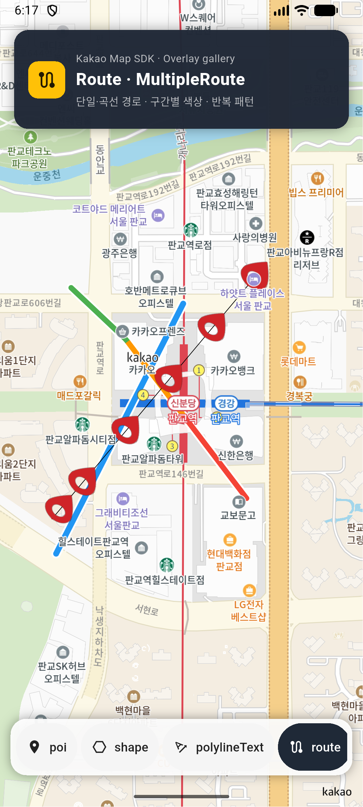
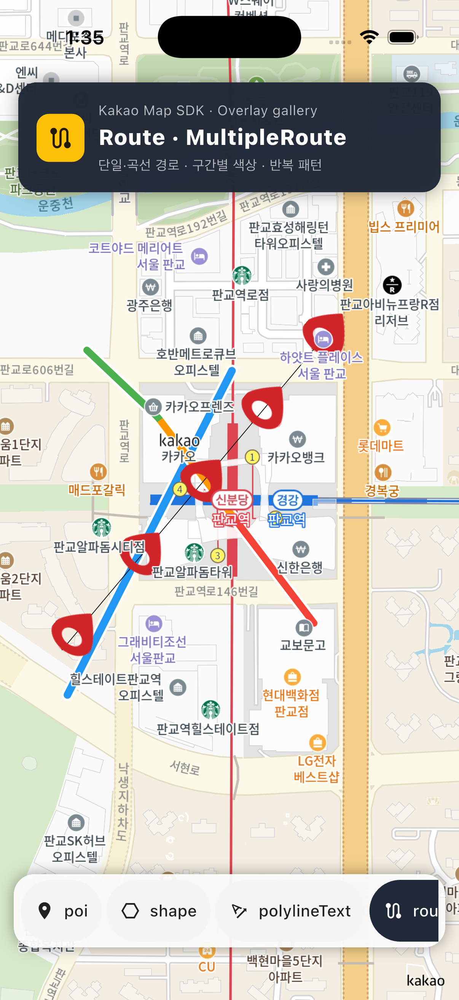
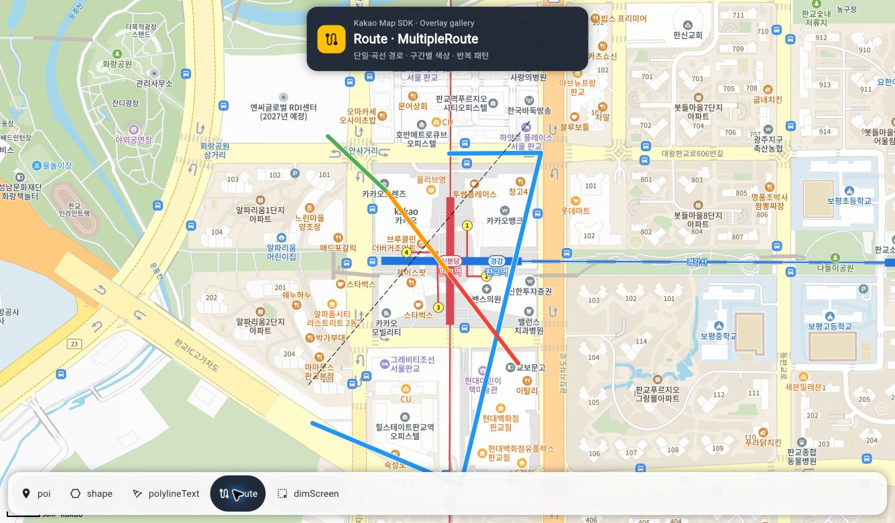

# 경로 (Route, MultipleRoute)

Route는 위경도 좌표 목록을 따라 경로선을 지도에 표시하는 요소입니다.\
내비게이션 경로, 이동 경로 등을 시각화할 때 사용합니다.\
[RouteController](https://pub.dev/documentation/kakao_map_sdk/latest/kakao_map_sdk/RouteController-class.html)를 통해 경로를 생성하고 관리할 수 있습니다.

MultipleRoute는 하나의 경로를 구간(Segment)별로 나눠 각각 다른 스타일을 적용할 수 있는 요소입니다.\
교통 혼잡도나 도로 유형에 따라 구간별로 색상을 달리하여 표시하는 데 활용할 수 있습니다.

아래 화면은 단일 Route의 곡선, 초록·주황·빨강 MultipleRoute 구간, 반복 Pattern 경로를 함께 표시한 실제 실행 결과입니다. Web은 `127.0.0.1:8080` Profile 모드로 촬영했으며 Pattern 이미지는 점선으로 대체됩니다.

<table>
  <thead>
    <tr><th>Android</th><th>iOS</th><th>Web · Profile · 8080</th></tr>
  </thead>
  <tbody>
    <tr>
      <td></td>
      <td></td>
      <td></td>
    </tr>
  </tbody>
</table>

## 1. 경로 스타일 등록하기

경로를 추가할 때 등록되지 않은 [RouteStyle](https://pub.dev/documentation/kakao_map_sdk/latest/kakao_map_sdk/RouteStyle-class.html)은 자동으로 등록됩니다. 여러 경로에 같은 스타일을 공유하거나 등록 오류를 먼저 처리하려면 [KakaoMapController.addRouteStyle()](https://pub.dev/documentation/kakao_map_sdk/latest/kakao_map_sdk/KakaoMapController/addRouteStyle.html)로 명시적으로 등록합니다.

```dart
Future<void> addRouteStyleExample(KakaoMapController controller) async {
  final style = RouteStyle(
    Colors.blue, // 선 색상
    12.0,        // 선 두께 (픽셀)
    strokeWidth: 4.0,
    strokeColor: Colors.white,
  );
  await controller.addRouteStyle(style);
}
```

<table><thead><tr><th width="150">Property</th><th>Description</th></tr></thead><tbody><tr><td>color</td><td>경로선의 색상입니다.</td></tr><tr><td>lineWidth</td><td>경로선의 두께입니다. 픽셀 단위로 입력합니다.</td></tr><tr><td>strokeWidth</td><td>경로선 외곽선의 두께입니다.</td></tr><tr><td>strokeColor</td><td>경로선 외곽선의 색상입니다.</td></tr><tr><td>pattern</td><td>경로선에 반복 패턴 이미지를 적용합니다. <a href="https://pub.dev/documentation/kakao_map_sdk/latest/kakao_map_sdk/RoutePattern-class.html">RoutePattern</a> 객체로 입력합니다.</td></tr><tr><td>zoomLevel</td><td>이 스타일이 적용되기 시작하는 최소 줌 레벨입니다.</td></tr></tbody></table>

### 1-1. 패턴 이미지 설정

경로선 위에 반복되는 패턴 이미지를 추가할 수 있습니다.\
화살표 등을 사용하여 경로 방향을 직관적으로 표시할 때 활용합니다.

```dart
final pattern = RoutePattern(
  KImage.fromAsset('assets/arrow.png', 20, 20), // 반복 패턴 이미지
  30.0,                                          // 패턴 간격 (픽셀)
  symbolImage: KImage.fromAsset('assets/symbol.png', 30, 30),
  pinStart: true, // 경로 시작점에 고정 표시
  pinEnd: true,   // 경로 끝점에 고정 표시
);

final style = RouteStyle.withPattern(pattern);
await controller.addRouteStyle(style);
```

> Web에서는 native RoutePattern 이미지를 그대로 반복하지 못하므로 점선 표현으로 대체됩니다.

<table><thead><tr><th width="150">Property</th><th>Description</th></tr></thead><tbody><tr><td>patternImage</td><td>경로선 위에 반복 표시할 이미지입니다.</td></tr><tr><td>distance</td><td>패턴 이미지 사이의 간격입니다. 픽셀 단위로 입력합니다.</td></tr><tr><td>symbolImage</td><td>패턴 이미지 사이에 표시할 보조 이미지입니다. (선택 사항)</td></tr><tr><td>pinStart</td><td>경로 시작점에 패턴 이미지를 고정 표시할지 여부입니다.</td></tr><tr><td>pinEnd</td><td>경로 끝점에 패턴 이미지를 고정 표시할지 여부입니다.</td></tr></tbody></table>

### 1-2. 줌 레벨별 스타일 설정

줌 레벨에 따라 서로 다른 경로 스타일을 적용할 수 있습니다.

```dart
final style = RouteStyle(Colors.grey, 4.0, zoomLevel: 0);
style.addStyle(14, Colors.blue, 8.0);  // 줌 레벨 14 이상에서 적용
style.addStyle(17, Colors.blue, 12.0); // 줌 레벨 17 이상에서 적용
await controller.addRouteStyle(style);
```

> 줌 레벨 값은 낮은 값부터 순서대로 입력해야 정상적으로 동작합니다.

## 2. Route 추가하기

[RouteController.addRoute()](https://pub.dev/documentation/kakao_map_sdk/latest/kakao_map_sdk/RouteController/addRoute.html) 함수를 이용하여 지도에 경로를 추가할 수 있습니다.\
[KakaoMapController.routeLayer](https://pub.dev/documentation/kakao_map_sdk/latest/kakao_map_sdk/KakaoMapController/routeLayer.html)를 통해 기본 RouteLayer에 접근합니다.

```dart
Future<void> addRouteExample(KakaoMapController controller) async {
  final style = RouteStyle(
    Colors.blue, 12.0,
    strokeWidth: 4,
    strokeColor: Colors.white,
  );
  await controller.addRouteStyle(style);

  final route = await controller.routeLayer.addRoute(
    [
      const LatLng(37.394776, 127.11116),
      const LatLng(37.450, 127.050),
      const LatLng(37.500, 127.000),
      const LatLng(37.56664, 126.97822),
    ],
    style,
  );
}
```

### 2-1. 곡선 경로 설정

경로에 곡선 효과를 적용할 수 있습니다.

```dart
final route = await controller.routeLayer.addRoute(
  points,
  style,
  curveType: CurveType.left, // 좌곡선 적용
);
```

<table><thead><tr><th width="200">Value</th><th>Description</th></tr></thead><tbody><tr><td>CurveType.none</td><td>직선으로 경로를 그립니다. (기본값)</td></tr><tr><td>CurveType.left</td><td>좌측으로 휘어지는 곡선으로 경로를 그립니다.</td></tr><tr><td>CurveType.right</td><td>우측으로 휘어지는 곡선으로 경로를 그립니다.</td></tr></tbody></table>

### 2-2. Route 조작

```dart
// 스타일 변경
final newStyle = RouteStyle(Colors.red, 10.0);
await controller.addRouteStyle(newStyle);
await route.changeStyle(newStyle);

// 경로 좌표 변경
await route.changePoint([/* 새로운 좌표 목록 */]);

// 곡선 유형 변경
await route.changeCurveType(CurveType.right);

// Z-Order 변경
await route.setZOrder(10002);

// 표시/숨기기 및 삭제
await route.show();
await route.hide();
await route.remove();

// 레이어 내 모든 Route 일괄 제어
await controller.routeLayer.showAllRoute();
await controller.routeLayer.hideAllRoute();
```

## 3. MultipleRoute 추가하기

MultipleRoute는 경로를 여러 구간(Segment)으로 나눠 각 구간마다 다른 스타일을 적용할 수 있습니다.

### 3-1. 다중 스타일 등록

MultipleRoute에 사용할 여러 스타일을 [KakaoMapController.addMultipleRouteStyle()](https://pub.dev/documentation/kakao_map_sdk/latest/kakao_map_sdk/KakaoMapController/addMultipleRouteStyle.html) 함수로 한 번에 등록합니다.\
배열에 등록한 순서가 각 스타일의 인덱스 번호가 됩니다.

```dart
final styles = [
  RouteStyle(Colors.green, 12.0, strokeWidth: 4, strokeColor: Colors.white),  // 인덱스 0: 원활
  RouteStyle(Colors.orange, 12.0, strokeWidth: 4, strokeColor: Colors.white), // 인덱스 1: 서행
  RouteStyle(Colors.red, 12.0, strokeWidth: 4, strokeColor: Colors.white),    // 인덱스 2: 정체
];
await controller.addMultipleRouteStyle(styles);
```

### 3-2. MultipleRouteOption 구성

[MultipleRouteOption](https://pub.dev/documentation/kakao_map_sdk/latest/kakao_map_sdk/MultipleRouteOption-class.html)을 이용하여 구간별 경로 좌표와 적용할 스타일을 설정합니다.

```dart
Future<void> addMultipleRouteExample(KakaoMapController controller) async {
  final styles = [
    RouteStyle(Colors.green, 12.0, strokeWidth: 4, strokeColor: Colors.white),
    RouteStyle(Colors.orange, 12.0, strokeWidth: 4, strokeColor: Colors.white),
    RouteStyle(Colors.red, 12.0, strokeWidth: 4, strokeColor: Colors.white),
  ];
  await controller.addMultipleRouteStyle(styles);

  final option = MultipleRouteOption(styles);

  // styles 목록의 인덱스로 구간을 연결합니다.
  option.addRouteWithIndex(
    [const LatLng(37.394776, 127.11116), const LatLng(37.420, 127.080)],
    0, // 원활 구간
  );

  option.addRouteWithIndex(
    [const LatLng(37.420, 127.080), const LatLng(37.480, 127.030)],
    1, // 서행 구간
  );
  option.addRouteWithIndex(
    [const LatLng(37.480, 127.030), const LatLng(37.56664, 126.97822)],
    2, // 정체 구간
    CurveType.left, // 곡선 적용
  );

  final multipleRoute = await controller.routeLayer.addMultipleRoute(option);
}
```

### 3-3. MultipleRoute 조작

```dart
// 스타일 변경
await multipleRoute.changeStyle([newStyle1, newStyle2, newStyle3]);

// 표시/숨기기 및 삭제
await multipleRoute.show();
await multipleRoute.hide();
await multipleRoute.remove();
```

## 4. 커스텀 RouteLayer 생성하기

기본 레이어 외에 커스텀 RouteLayer를 생성하여 경로를 독립적으로 관리할 수 있습니다.

```dart
Future<void> customRouteLayerExample(KakaoMapController controller) async {
  final myLayer = await controller.addRouteLayer(
    'my_route_layer',
    zOrder: 10002,
  );

  await myLayer.addRoute(points, style);

  // ID로 레이어 가져오기
  final sameLayer = controller.getRouteLayer('my_route_layer');

  // 레이어 삭제
await controller.removeRouteLayer(myLayer);
}
```

## 5. 플랫폼별 주의사항

* Web은 Route 이미지 패턴을 점선으로 대체합니다.
* Route 좌표를 변경할 때는 `changePoint()`를 `await`해야 스타일과 geometry 갱신 순서가 보장됩니다.
* `getRouteStyle()`과 `getMultipleRouteStyle()`을 사용하세요. 철자가 잘못된 `getRotueStyle()`, `getMultipleRotueStyle()`은 하위 호환을 위해 남아 있지만 deprecated 상태입니다.
* Route와 MultipleRoute는 같은 RouteLayer의 ID 저장소를 공유하므로 서로 다른 유형이라도 ID가 중복되면 안 됩니다.
